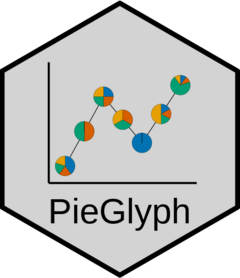

<!-- README.md is generated from README.Rmd. Please edit that file -->

```{r, include = FALSE}
knitr::opts_chunk$set(
  collapse = TRUE,
  comment = "#>",
  fig.path = "man/figures/README-"
)
```


# PieGlyph 


<!-- badges: start -->
[](https://CRAN.R-project.org/package=PieGlyph)
[](https://lifecycle.r-lib.org/articles/stages.html#stable)
[](https://github.com/rishvish/PieGlyph/actions/workflows/R-CMD-check.yaml)
<!-- badges: end -->

`PieGlyph` is an R package aimed at replacing points in a plot with pie-chart glyphs, showing the relative proportions of different categories. The pie-chart glyphs are invariant to the axes and plot dimensions to prevent distortions when the plot dimensions are changed.

## Installation

You can install the released version of `PieGlyph` from [CRAN](https://cran.r-project.org/) by running:
``` r
install.packages("PieGlyph")
```
Alternatively, you can install the development version of `PieGlyph` from [GitHub](https://github.com/) with:

``` r
# install.packages("devtools")
devtools::install_github("rishvish/PieGlyph")
```

## Examples

#### Load libraries

```{r libs, warning=F, message=F}
library(tidyverse)
library(PieGlyph)
```

#### Simulate raw data

```{r data}
set.seed(123)
plot_data <- data.frame(response = rnorm(30, 100, 30),
                        system = 1:30,
                        group = sample(size = 30, x = c('G1', 'G2', 'G3'), replace = T),
                        A = round(runif(30, 3, 9), 2),
                        B = round(runif(30, 1, 5), 2),
                        C = round(runif(30, 3, 7), 2),
                        D = round(runif(30, 1, 9), 2))
```

<p> The data has 30 observations and seven columns. `response` is a continuous variable measuring system output while `system` describes the 30 individual systems of interest. Each system is placed in one of three groups shown in `group`. Columns `A`, `B`, `C`, and `D` measure system attributes. </p>

```{r data_subset}
head(plot_data)
```

#### Create scatter plot with pie-charts

<p> We can plot the outputs for each system as a scatterplot and replace the points with pie-chart glyphs showing the relative proportions of the four system attributes </p>

#### Basic plot

```{r basic, fig.align='center', fig.width=8}
ggplot(data = plot_data, aes(x = system, y = response))+
  geom_pie_glyph(slices = c('A', 'B', 'C', 'D'))+
  theme_classic()
```

#### Change pie radius and border colour

```{r border, fig.align='center', fig.width=8}
ggplot(data = plot_data, aes(x = system, y = response))+
  # Can also specify slices as column indices
  geom_pie_glyph(slices = 4:7, colour = 'black', radius = 0.5)+ 
  theme_classic()
```

#### Map radius to a variable

```{r map, fig.align='center', fig.width=8}
p <- ggplot(data = plot_data, aes(x = system, y = response))+
        geom_pie_glyph(aes(radius = group), 
                       slices = c('A', 'B', 'C', 'D'), 
                       colour = 'black')+
        theme_classic()
p
```

#### Adjust radius for groups

```{r radius, fig.align='center', fig.width=8}
p <- p + scale_radius_manual(values = c(0.25, 0.5, 0.75), unit = 'cm')
p
```

#### Add custom labels

```{r labels, fig.align='center', fig.width=8}
p <- p + labs(x = 'System', y = 'Response', fill = 'Attributes', radius = 'Group')
p
```

#### Change category colours

```{r colours, fig.align='center', fig.width=8}
p + scale_fill_manual(values = c('#56B4E9', '#CC79A7', '#F0E442', '#D55E00'))
```

### Alternative specification

<p> The attributes can also be stacked into one column to generate the plot. This variant of the function is useful for situations  when the data is in tidy format. See `vignette('tidy-data')` and `vignette('pivot')` for more information. </p>


#### Stack the attributes in one column

```{r data_stacking}
plot_data_stacked <- plot_data %>% 
  pivot_longer(cols = c('A','B','C','D'), 
               names_to = 'Attributes', 
               values_to = 'values')
head(plot_data_stacked, 8)
```

#### Create plot

```{r stacked, fig.align='center', fig.width=8}
ggplot(data = plot_data_stacked, aes(x = system, y = response))+
  # Along with categories column, values column is also needed now
  geom_pie_glyph(slices = 'Attributes', values = 'values')+
  theme_classic()
```

