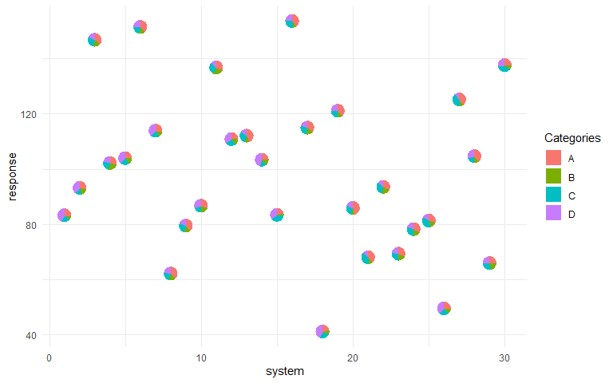
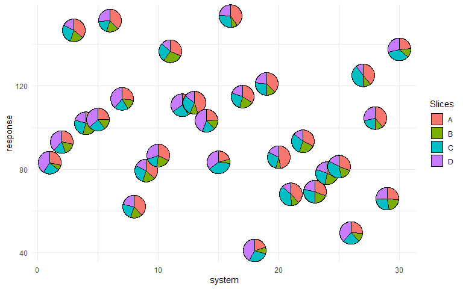
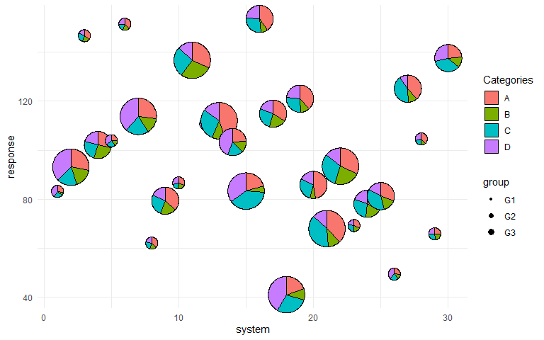
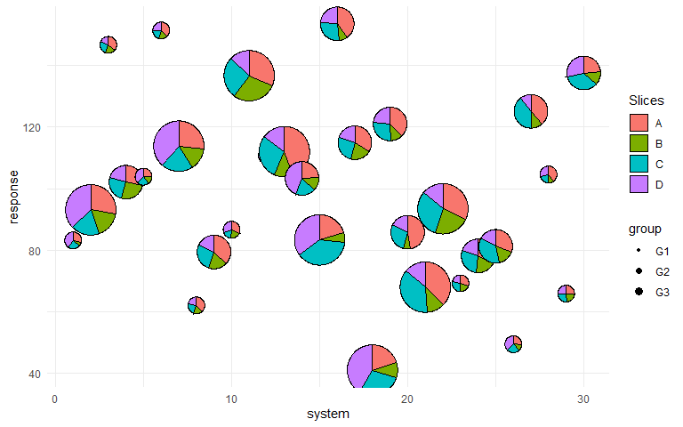
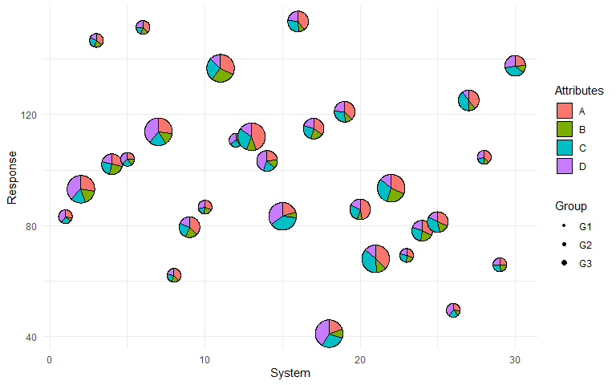
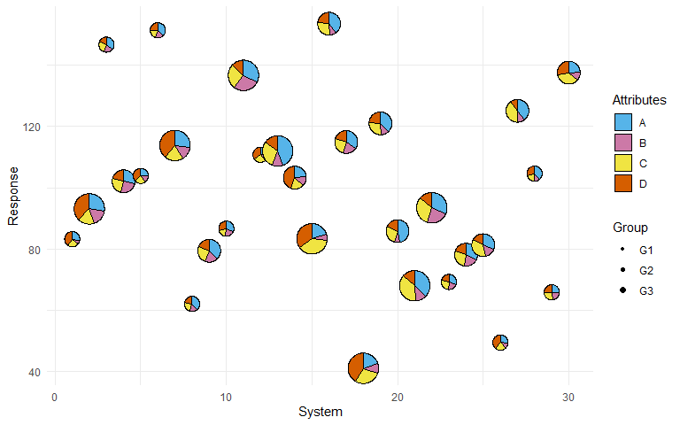
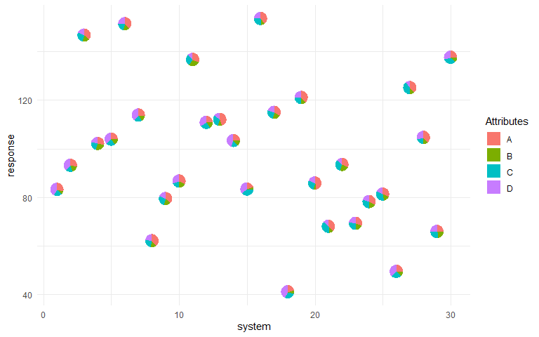

<!-- README.md is generated from README.Rmd. Please edit that file -->

# PieGlyph 

<!-- badges: start -->

[](https://CRAN.R-project.org/package=PieGlyph)
[](https://lifecycle.r-lib.org/articles/stages.html#stable)
[](https://github.com/rishvish/PieGlyph/actions/workflows/R-CMD-check.yaml)
[](https://app.codecov.io/gh/rishvish/PieGlyph?branch=main)
<!-- badges: end -->

`PieGlyph` is an R package aimed at replacing points in a plot with
pie-chart glyphs, showing the relative proportions of different
categories. The pie-chart glyphs are invariant to the axes and plot
dimensions to prevent distortions when the plot dimensions are changed.

## Installation

You can install the released version of `PieGlyph` from
[CRAN](https://cran.r-project.org/) by running:

``` r
install.packages("PieGlyph")
```

Alternatively, you can install the development version of `PieGlyph`
from [GitHub](https://github.com/) with:

``` r
# install.packages("devtools")
devtools::install_github("rishvish/PieGlyph")
```

## Examples

#### Load libraries

``` r
library(dplyr)
library(tidyr)
library(ggplot2)
library(PieGlyph)
library(ggiraph)
```

#### Simulate raw data

``` r
set.seed(123)
plot_data <- data.frame(response = rnorm(30, 100, 30),
                        system = 1:30,
                        group = sample(size = 30, x = c('G1', 'G2', 'G3'), replace = T),
                        A = round(runif(30, 3, 9), 2),
                        B = round(runif(30, 1, 5), 2),
                        C = round(runif(30, 3, 7), 2),
                        D = round(runif(30, 1, 9), 2))
```

The data has 30 observations and seven columns. `response` is a
continuous variable measuring system output while `system` describes the
30 individual systems of interest. Each system is placed in one of three
groups shown in `group`. Columns `A`, `B`, `C`, and `D` measure system
attributes.

``` r
head(plot_data)
#>    response system group    A    B    C    D
#> 1  83.18573      1    G1 5.80 1.57 4.78 8.31
#> 2  93.09468      2    G3 6.07 3.76 3.87 8.21
#> 3 146.76125      3    G1 6.60 3.48 5.01 3.19
#> 4 102.11525      4    G2 5.00 4.57 4.42 3.57
#> 5 103.87863      5    G1 5.93 3.69 5.60 8.89
#> 6 151.45195      6    G1 8.73 3.95 4.50 5.96
```

#### Create scatter plot with pie-charts

We can plot the outputs for each system as a scatterplot and replace the
points with pie-chart glyphs showing the relative proportions of the
four system attributes.

#### Basic plot

``` r
ggplot(data = plot_data, aes(x = system, y = response))+
  geom_pie_glyph(slices = c('A', 'B', 'C', 'D'))+
  theme_classic()
```



#### Change pie radius and border colour

``` r
ggplot(data = plot_data, aes(x = system, y = response))+
  # Can also specify slices as column indices
  geom_pie_glyph(slices = 4:7, colour = 'black', radius = 0.5)+ 
  theme_classic()
```



#### Map radius to a variable

``` r
p <- ggplot(data = plot_data, aes(x = system, y = response))+
        geom_pie_glyph(aes(radius = group), 
                       slices = c('A', 'B', 'C', 'D'), 
                       colour = 'black')+
        theme_classic()
p
```



#### Adjust radius for groups

``` r
p <- p + scale_radius_manual(values = c(0.25, 0.5, 0.75), unit = 'cm')
p
```



#### Add custom labels

``` r
p <- p + labs(x = 'System', y = 'Response', fill = 'Attributes', radius = 'Group')
p
```



#### Change category colours

``` r
p + scale_fill_manual(values = c('#56B4E9', '#CC79A7', '#F0E442', '#D55E00'))
```



### Alternative specification

The attributes can also be stacked into one column to generate the plot.
This variant of the function is useful for situations when the data is
in tidy format. See `vignette('tidy-data')` and `vignette('pivot')` for
more information.

#### Stack the attributes in one column

``` r
plot_data_stacked <- plot_data %>% 
  pivot_longer(cols = c('A','B','C','D'), 
               names_to = 'Attributes', 
               values_to = 'values')
head(plot_data_stacked, 8)
#> # A tibble: 8 × 5
#>   response system group Attributes values
#>      <dbl>  <int> <chr> <chr>       <dbl>
#> 1     83.2      1 G1    A            5.8 
#> 2     83.2      1 G1    B            1.57
#> 3     83.2      1 G1    C            4.78
#> 4     83.2      1 G1    D            8.31
#> 5     93.1      2 G3    A            6.07
#> 6     93.1      2 G3    B            3.76
#> 7     93.1      2 G3    C            3.87
#> 8     93.1      2 G3    D            8.21
```

#### Create plot

``` r
ggplot(data = plot_data_stacked, aes(x = system, y = response))+
  # Along with categories column, values column is also needed now
  geom_pie_glyph(slices = 'Attributes', values = 'values')+
  theme_classic()
```



### Interactive pie-chart glyphs

It is also possible to create interactive pie-chart scatterplots using
the `geom_pie_interactive` function via the
[ggiraph](https://davidgohel.github.io/ggiraph/) framework.

Hovering over a pie-chart glyph will show a tooltip containing
information about the raw counts and percentages of the categories
(system attributes in this example) shown in the pie-charts. All
additional features by ggiraph are also supported. See the [ggiraph
book](https://www.ardata.fr/ggiraph-book/) and
`vignette("interactive-pie-glyphs")` for more information.

``` r
plot_obj <- ggplot(data = plot_data)+
              geom_pie_interactive(aes(x = system, y = response,
                                       data_id = system),
                                   slices = c("A", "B", "C", "D"), 
                                   colour = "black")+
              theme_classic()

girafe(ggobj = plot_obj, height_svg = 6, width_svg = 8)
```


