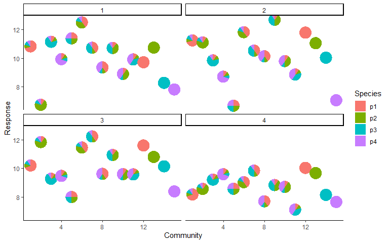
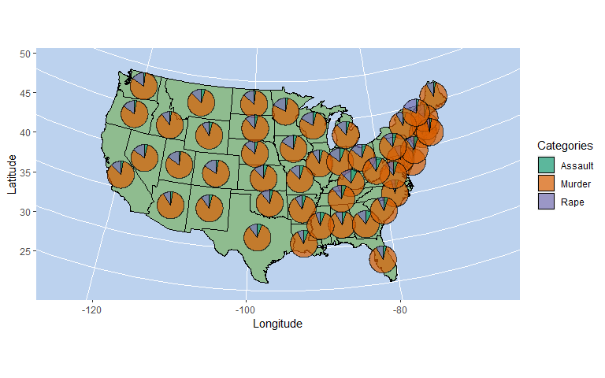

<!-- README.md is generated from README.Rmd. Please edit that file -->

# PieGlyph

<!-- badges: start -->
<!-- badges: end -->

The goal of PieGlyph is to create pie-scatter plots with pies invariant
to plot dimensions to avoid any distortions of the pies.

## Installation

You can install the development version of PieGlyph from
[GitHub](https://github.com/) with:

``` r
# install.packages("devtools")
devtools::install_github("rishvish/PieGlyph")
```

## Examples

### Ecology example

``` r
########### Example from ecology

### Create a pie-scatter plot of the response vs richness in an ecosystem with each pie representing the proportion of the different species in a particular community

#install.packages(DImodels)
library(PieGlyph)
library(DImodels)
library(tidyr)
library(ggplot2)
library(dplyr)

## Load the data
## This data consists of 4 species named p1, p2, p3 and p4 comprised of 15 communities with varying proportions of each species. Each of these 15 communities is then replicated across 4 blocking structures. The response can be assumed to be the yield of each community.
data(sim1)
species <- paste0('p',1:4)

## Add richness (number of species) and evenness (measure of uniformity between species proportions) to the data and stack species proportions together for plotting
plot_data <- sim1 %>%
            filter(block %in% c(1,2)) %>%
            mutate(Richness = rowSums(.[, species] != 0),
                  Evenness = DI_data(prop = species, what = 'E', data = .)) %>%
            pivot_longer(cols = all_of(species),
                         names_to = 'Species', values_to = 'Prop')

## Create a response vs richness plot with points replaced by pie glyphs depicting the proportions of the different species in the community
ggplot(data = plot_data)+
   geom_pie_glyph(aes(x = Richness, y = response, group = Evenness),
                  categories = 'Species', values = 'Prop', colour = NA,
                  position = position_dodge(1))+
   facet_wrap(~block)+
   labs(y = 'Response', x = 'Richness')+
   theme_classic()
```

<!-- -->

### Spatial data example

``` r

############# Spatial example

### Creating a map of the US states with pie charts at the center of each state representing the proportions of arrests in the state across murder, rape, and assault

#install.packages('maps')
library(dplyr)
library(ggplot2)

## All datasets available in base R
## Get latitude and longitude values for US states
states <- map_data("state")

## Data showing counts of arrests per 100,000 residents for assault, murder, and rape in each of the 50 US states in 1973
arrests <- USArrests

## Data showing the geographical center of US states
centers <- state.center

## Add state centers to arrests data
arrests <- arrests %>% mutate(region = tolower(rownames(USArrests)),
                              pie_lat = centers$y,
                              pie_long = centers$x)
## Merge map data with arrests data to get coordinates to place pie glyphs
choro <- merge(states, arrests, sort = FALSE, by = "region")
pie_data <- choro %>% group_by(region) %>% slice(1) %>%
                      select(region, pie_lat, pie_long,
                             Murder, Assault, Rape)

## Create plot (Can also create without stacking the category values together)
ggplot(states, aes(x = long, y = lat)) +
  geom_polygon(aes(group = group),
               fill = 'darkseagreen', colour = 'black')+
  geom_pie_glyph(aes(y = pie_lat, x = pie_long),
                 data = pie_data, categories = 4:6,
                 radius = 1, colour = 'black', alpha = 0.7)+
  coord_map("albers",  lat0 = 45.5, lat1 = 29.5)+
  labs(x = 'Longitude', y ='Latitude')+
  theme(panel.background = element_rect(fill = 'lightsteelblue2'))+
  scale_fill_brewer(palette = 'Dark2')
```

<!-- -->

### Compositions example

``` r

############# Compositions example

### Create a lollipop plot showing relationship between probability of having a disease and the abundances of four different proteins in the blood

#install.packages('compositions')
library(dplyr)
library(ggplot2)
library(tidyr)
library(forcats)


## Load data
## This data records the proportions of the 4 serum proteins from blood samples of 30 patients, 14 with known disease A, 16 with known disease B, and 6 new cases.
data("SerumProtein", package = 'compositions')

## Fit Logistic regression model to assess relationship between probability of having disease A and the four protein types
disease_data <- as_tibble(SerumProtein) %>%
                     mutate(Type = factor(ifelse(Type == 1, 'Yes', 'No')))
m1 <- glm(Type ~ a + b + c + d, data = disease_data,
          family=binomial(link='logit'))
summary(m1)
#> 
#> Call:
#> glm(formula = Type ~ a + b + c + d, family = binomial(link = "logit"), 
#>     data = disease_data)
#> 
#> Deviance Residuals: 
#>      Min        1Q    Median        3Q       Max  
#> -1.81195  -0.30675  -0.01756   0.37482   2.47650  
#> 
#> Coefficients:
#>             Estimate Std. Error z value Pr(>|z|)  
#> (Intercept)   -7.775     43.705  -0.178   0.8588  
#> a              1.238     44.510   0.028   0.9778  
#> b             92.429     62.862   1.470   0.1415  
#> c             93.685     65.544   1.429   0.1529  
#> d           -114.080     56.479  -2.020   0.0434 *
#> ---
#> Signif. codes:  0 '***' 0.001 '**' 0.01 '*' 0.05 '.' 0.1 ' ' 1
#> 
#> (Dispersion parameter for binomial family taken to be 1)
#> 
#>     Null deviance: 48.114  on 35  degrees of freedom
#> Residual deviance: 21.092  on 31  degrees of freedom
#> AIC: 31.092
#> 
#> Number of Fisher Scoring iterations: 7

## Prepare data for plotting by adding the predicted probability of having the disease to the data and case number. The data is then arranged in descending order of the predicted probabilities and the marker proportions are stacked together for plotting
plot_data <- disease_data %>%
    mutate('prediction' = predict(m1, type = 'response'),
           'n' = as.character(1:nrow(.))) %>%
    arrange(desc(prediction)) %>%
    mutate(n = fct_inorder(n)) %>%
    pivot_longer(cols = c('a','b','c','d'), names_to = 'Marker',
                 values_to = 'Proportion')

## Create lollipop plot
ggplot(data = plot_data, aes(x = n, y = prediction, fill = Marker))+
  geom_segment(aes(yend = 0, xend = n))+
  geom_pie_glyph(categories = 'Marker', values = 'Proportion',
                 radius = 0.75, colour = 'black')+
  labs(y = 'Prob(Having Disease)', x = 'Case')+
  theme_minimal()
```

<!-- -->
