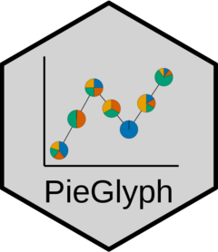
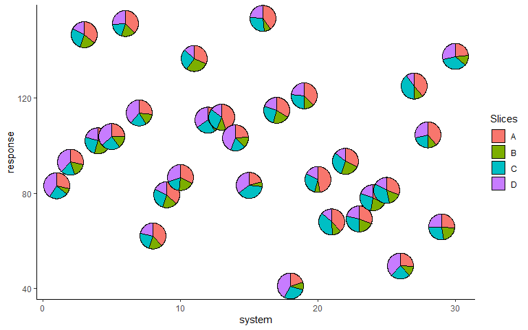
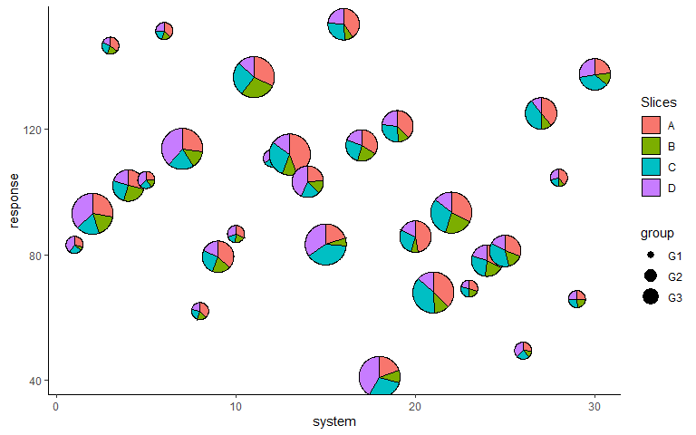
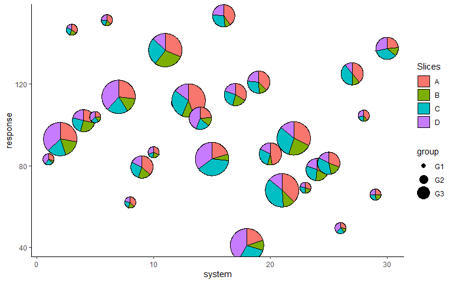
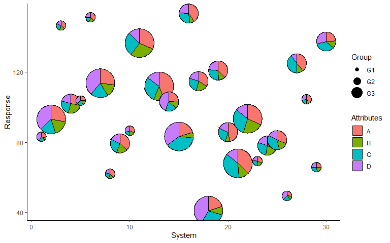
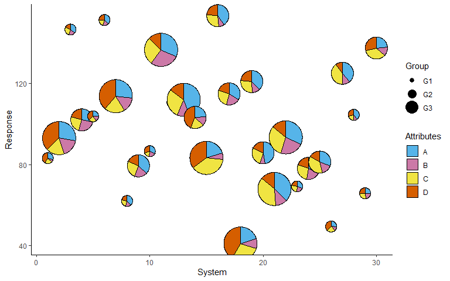

<!-- README.md is generated from README.Rmd. Please edit that file -->

# PieGlyph 

<!-- badges: start -->

[](https://CRAN.R-project.org/package=PieGlyph)
[](https://lifecycle.r-lib.org/articles/stages.html#stable)
<!-- badges: end -->

`PieGlyph` is an R package aimed at replacing points in a plot with
pie-charts glyphs, showing the relative proportions of different
categories. The pie-chart glyphs are invariant to the axes and plot
dimensions to prevent distortions when the plot dimensions are changed.

## Installation

You can install the development version of `PieGlyph` from
[GitHub](https://github.com/) with:

``` r
# install.packages("devtools")
devtools::install_github("rishvish/PieGlyph")
```

## Examples

#### Load libraries

``` r
library(tidyverse)
library(PieGlyph)
```

#### Simulate raw data

``` r
set.seed(123)
plot_data <- data.frame(response = rnorm(30, 100, 30),
                        system = 1:30,
                        group = sample(size = 30, x = c('G1', 'G2', 'G3'), replace = T),
                        A = round(runif(30, 3, 9), 2),
                        B = round(runif(30, 1, 5), 2),
                        C = round(runif(30, 3, 7), 2),
                        D = round(runif(30, 1, 9), 2))
```

<p>
The data has 30 observations and seven columns. `response` is a
continuous variable measuring system output while `system` describes the
30 individual systems of interest. Each system is placed in one of three
groups shown in `group`. Columns `A`, `B`, `C`, and `D` measure system
attributes.
</p>

``` r
head(plot_data)
#>    response system group    A    B    C    D
#> 1  83.18573      1    G1 5.80 1.57 4.78 8.31
#> 2  93.09468      2    G3 6.07 3.76 3.87 8.21
#> 3 146.76125      3    G1 6.60 3.48 5.01 3.19
#> 4 102.11525      4    G2 5.00 4.57 4.42 3.57
#> 5 103.87863      5    G1 5.93 3.69 5.60 8.89
#> 6 151.45195      6    G1 8.73 3.95 4.50 5.96
```

#### Create scatter plot with pie-charts

<p>
We can plot the outputs for each system as a scatterplot and replace the
points with pie-chart glyphs showing the relative proportions of the
four system attributes
</p>

#### Basic plot

``` r
ggplot(data = plot_data, aes(x = system, y = response))+
  geom_pie_glyph(categories = c('A', 'B', 'C', 'D'), data = plot_data)+
  theme_minimal()
```


#### Change pie radius and border colour

``` r
ggplot(data = plot_data, aes(x = system, y = response))+
  # Can also specify categories as column indices
  geom_pie_glyph(categories = 4:7, data = plot_data, colour = 'black', radius = 1)+ 
  theme_minimal()
```



#### Map size to a variable

``` r
p <- ggplot(data = plot_data, aes(x = system, y = response))+
        geom_pie_glyph(aes(radius = group), 
                       categories = c('A', 'B', 'C', 'D'), 
                       data = plot_data, colour = 'black')+
        theme_minimal()
p
```



#### Adjust radius for groups

``` r
p <- p + scale_radius_manual(values = c(0.5, 0.75, 1), unit = 'cm')
p
```



#### Add custom labels

``` r
p <- p + labs(x = 'System', y = 'Response', fill = 'Attributes', radius = 'Group')
p
```



#### Change category colours

``` r
p + scale_fill_manual(values = c('#56B4E9', '#CC79A7', '#F0E442', '#D55E00'))
```



### Alternative specification

<p>
The attributes can also be stacked into one column to generate the plot.
The benefit of doing this is that we don’t need to specify the data
again in the geom_pie_glyph function.
</p>

#### Stack the attributes in one column

``` r
plot_data_stacked <- plot_data %>% pivot_longer(cols = c('A','B','C','D'), 
                                                names_to = 'Attributes', 
                                                values_to = 'values')
head(plot_data_stacked, 8)
#> # A tibble: 8 × 5
#>   response system group Attributes values
#>      <dbl>  <int> <chr> <chr>       <dbl>
#> 1     83.2      1 G1    A            5.8 
#> 2     83.2      1 G1    B            1.57
#> 3     83.2      1 G1    C            4.78
#> 4     83.2      1 G1    D            8.31
#> 5     93.1      2 G3    A            6.07
#> 6     93.1      2 G3    B            3.76
#> 7     93.1      2 G3    C            3.87
#> 8     93.1      2 G3    D            8.21
```

#### Create plot

``` r
ggplot(data = plot_data_stacked, aes(x = system, y = response))+
  # Along with categories column, values column is also needed now
  geom_pie_glyph(categories = 'Attributes', values = 'values')+
  theme_minimal()
```


