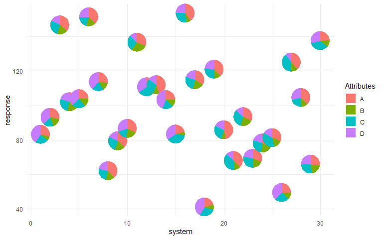

```{r, include = FALSE}
knitr::opts_chunk$set(
  collapse = TRUE,
  comment = "#>",
  fig.path = "man/figures/index-"
)
```


```{css, echo = F}
body {
  text-align: justify;
}

p {
  font-weight: 'normal';
  font-size: '12px;
  text-align: justify;
}
```

# PieGlyph 

`PieGlyph` is an R package aimed at replacing points in a plot with pie-charts glyphs, showing the relative proportions of different categories. The pie-chart glyphs are invariant to the axes and plot dimensions to prevent distortions when the plot dimensions are changed.

## Installation

You can install the released version of `PieGlyph` from [CRAN](https://cran.r-project.org/) by running:
``` r
install.packages("PieGlyph")
```
Alternatively, you can install the development version of `PieGlyph` from [GitHub](https://github.com/) with:

``` r
# install.packages("devtools")
devtools::install_github("rishvish/PieGlyph")
```

## Example

#### Load libraries

```{r libs, warning=F, message=F}
library(tidyverse)
library(PieGlyph)
```

#### Simulate raw data

```{r data}
set.seed(123)
plot_data <- data.frame(response = rnorm(30, 100, 30),
                        system = 1:30,
                        group = sample(size = 30, x = c("G1", "G2", "G3"), replace = T),
                        A = round(runif(30, 3, 9), 2),
                        B = round(runif(30, 1, 5), 2),
                        C = round(runif(30, 3, 7), 2),
                        D = round(runif(30, 1, 9), 2))
```

#### Create plot

```{r basic, fig.align='center', fig.width=8, eval = FALSE}
ggplot(data = plot_data, aes(x = system, y = response))+
  geom_pie_glyph(slices = c("A", "B", "C", "D"))+
  theme_minimal()
```

```{r echo=FALSE, fig.align='center', fig.cap='', out.width='100%'}

```

### Alternative specification

<p> The attributes can also be stacked into one column to generate the plot. This variant of the function is useful for situations  when the data is in tidy format. See `vignette('tidy-data')` and `vignette('pivot')` for more information. </p>


#### Stack the attributes in one column

```{r data_stacking}
plot_data_stacked <- plot_data %>%
  pivot_longer(cols = c("A", "B", "C", "D"), 
               names_to = "Attributes", 
               values_to = "values")
head(plot_data_stacked, 8)
```

#### Create plot

```{r stacked, fig.align='center', fig.width=8, eval=FALSE}
ggplot(data = plot_data_stacked, aes(x = system, y = response))+
  # Along with slices column, values column is also needed now
  geom_pie_glyph(slices = 'Attributes', values = 'values')+
  theme_minimal()
```

```{r echo=FALSE, fig.align='center', fig.cap='', out.width='100%'}

```

### Interactive pie-chart glyphs

It is also possible to create interactive pie-chart scatterplots using the `geom_pie_interactive` function via the [ggiraph](https://davidgohel.github.io/ggiraph/) framework.

Hovering over a pie-chart glyph will show a tooltip containing information about the raw counts and percentages of the categories (system attributes in this example) shown in the pie-charts. All additional features by ggiraph are also supported. See the [ggiraph book](https://www.ardata.fr/ggiraph-book/) and `vignette("interactive-pie-glyphs")` for more information.

```{r interactive, fig.align='center', fig.width=8, fig.height = 6, eval=FALSE}
plot_obj <- ggplot(data = plot_data)+
              geom_pie_interactive(aes(x = system, y = response,
                                       data_id = system),
                                   slices = c("A", "B", "C", "D"), 
                                   colour = "black")+
              theme_classic()

girafe(ggobj = plot_obj, height_svg = 6, width_svg = 8)
```

 </img>


