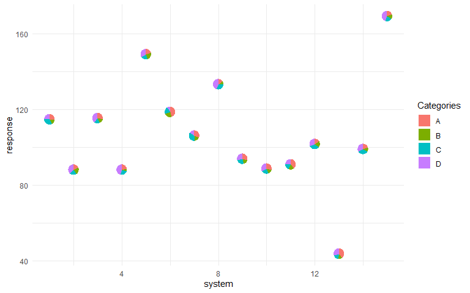
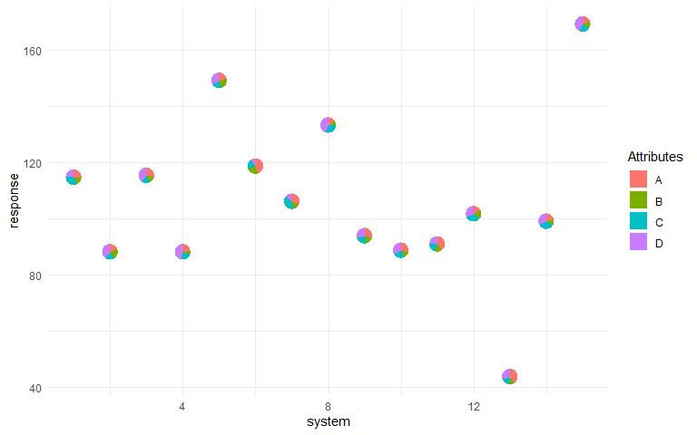

# PieGlyph 

`PieGlyph` is an R package aimed at replacing points in a plot with
pie-charts glyphs, showing the relative proportions of different
categories. The pie-chart glyphs are invariant to the axes and plot
dimensions to prevent distortions when the plot dimensions are changed.

## Installation

You can install the development version of `PieGlyph` from
[GitHub](https://github.com/) with:

    # install.packages("devtools")
    devtools::install_github("rishvish/PieGlyph")

## Example

#### Load libraries

    library(tidyverse)
    library(PieGlyph)

#### Simulate raw data

    set.seed(777)
    plot_data <- data.frame(response = rnorm(15, 100, 30),
                            system = 1:15,
                            group = sample(size = 15, x = c('G1', 'G2', 'G3'), replace = T),
                            A = round(runif(15, 3, 9), 2),
                            B = round(runif(15, 1, 5), 2),
                            C = round(runif(15, 3, 7), 2),
                            D = round(runif(15, 1, 9), 2))

#### Create plot

    ggplot(data = plot_data, aes(x = system, y = response))+
      geom_pie_glyph(categories = c('A', 'B', 'C', 'D'), data = plot_data)+
      theme_minimal()

### Alternative specification

The attributes can also be stacked into one column to generate the plot.
The benefit of doing this is that we don’t need to specify the data
again in the geom\_pie\_glyph function.

#### Stack the attributes in one column

    plot_data_stacked <- plot_data %>% pivot_longer(cols = c('A','B','C','D'), 
                                                    names_to = 'Attributes', 
                                                    values_to = 'values')
    head(plot_data_stacked, 8)
    #> # A tibble: 8 × 5
    #>   response system group Attributes values
    #>      <dbl>  <int> <chr> <chr>       <dbl>
    #> 1    115.       1 G2    A            3.24
    #> 2    115.       1 G2    B            2.03
    #> 3    115.       1 G2    C            4.35
    #> 4    115.       1 G2    D            2.78
    #> 5     88.0      2 G2    A            3.96
    #> 6     88.0      2 G2    B            4.74
    #> 7     88.0      2 G2    C            4.66
    #> 8     88.0      2 G2    D            8.45

#### Create plot

    ggplot(data = plot_data_stacked, aes(x = system, y = response))+
      # Along with categories column, values column is also needed now
      geom_pie_glyph(categories = 'Attributes', values = 'values')+
      theme_minimal()

