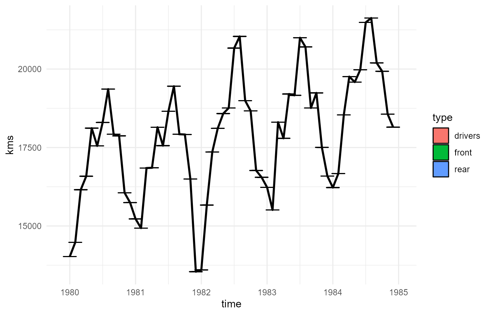
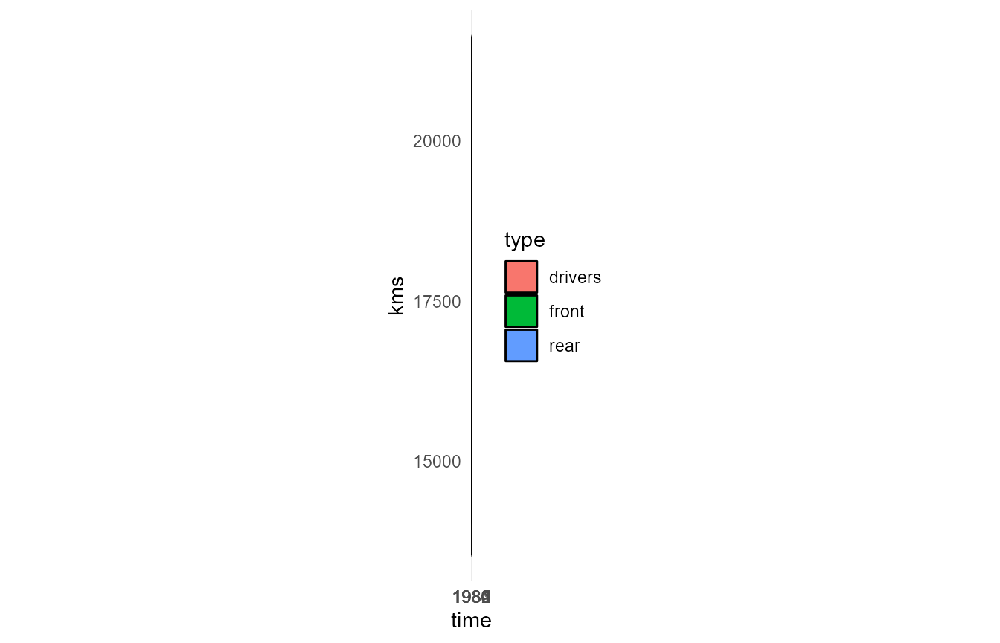

```{r, include = FALSE}
knitr::opts_chunk$set(
  collapse = TRUE,
  comment = "#>"
)
```

```{css, echo = F}
body {
  text-align: justify;
}

p {
  font-weight: 'normal';
  font-size: '16px
}
```
<p> This example shows the use of `PieGlyph` package to replace the points in a time series plot with pie charts showing the proportions of different variables. Generally, time series plots don't have an aspect ratio of 1 as the width of the plot is very large compared to the height. Due to this wide nature of time series plots previous attempts at adding pie-charts to the plot resulted in the circular pie-charts getting flattened into ellipses. This could be rectified by forcing the user to make the plot have equal dimensions, however that caused more problems as the resultant plots then became squashed between white space. These issues rendered the plots uninterpretable.</p>

<p> The `PieGlyph` package attempts to solve this problem by creating axis invariant pie-charts which wouldn't get squashed into ellipses and also wouldn't get scaled along with the plot dimensions. </p>

### Load Packages
```{r setup, warning=F, message=F}
library(PieGlyph)
library(ggplot2)
```

### Load data

<p>The data used for this example is the Seatbelts data which shows the monthly totals of car drivers and passengers killed or seriously injured from Jan 1969 to Dec 1984 in Great Britain.</p>

```{r simulate-data}
Seatbelts <- data.frame(Seatbelts, time = time(Seatbelts))
head(Seatbelts)
```

<p>For each month over the 15 years the variables `DriversKillled` gives the number of car drivers killed, `drivers` describes the number of car drivers killed or seriously injured, `front` gives the number of front-seat passengers killed or seriously injured and `rear` gives the number of rear-seat passengers killed or seriously injured, `VanKilled` contains the number of van (‘light goods vehicle’) drivers killed, `kms` gives the number of kilometers driven in the particular month while `PetrolPrice` contains the price of petrol. Finally, `law` describes whether or not it was compulsory to wear seat belts.</p>

<p>For the visualisation we'll be using a subset of the Seatbelts data from Jan 1980 to Dec 1984.</p>
```{r show-data}
plot_data <- Seatbelts[133:192, ]
head(plot_data)
```

<p> The number of kilometers driven in each month changes over time. It would be difficult to visualise this change over time whilst also showing the proportion of drivers/passengers injured over the time period using a simple time series plot. However, if we replace the points in the plot with pie-charts we can simultaneously visualise both the distance traveled and the proportion of injuries over time.</p>

### Create Plots

#### Problems with existing techniques
<p>Create a pie-chart plot for the Seatbelts data using the `scatterpie` R package.</p>
```{r scatterpie, fig.align='center', fig.width=7, eval = F}
p <- ggplot(plot_data, aes(x = time, y = kms))+
        geom_line(linewidth = 1)+
        geom_scatterpie(aes(x = time, y = kms), 
                        colour = 'black', 
                        data = plot_data,
                        cols = c('drivers','front', 'rear'))+
        theme_minimal()
```

```{r scatterpie-figure, fig.align='center', out.width = '95%', eval = T, echo = F}

```


<p>As mentioned before the pie-charts are squished due to the wide nature of the plot and are illegible.</p>
<p>Using `coord_fixed()` to fix the plot dimensions worsens the problem further and renders the plot unintelligible.</p>
```{r scatterpie-fixed, fig.align='center', fig.width=7, eval = F}
p + coord_fixed()
```

```{r scatterpie-fixed-figure, fig.align='center', out.width = '95%', eval = T, echo = F}

```

#### Fixing the problems using PieGlyph
<p>PieGlyph fixes this problem by creating the pie charts independently of the plot axes and thus the plot dimensions have no effects on the pie charts </p>
```{r Pie-glyph-plot, fig.align='center', fig.width = 7, fig.height=5, warning = F}
pl <- ggplot(plot_data, aes(x = time, y = kms))+
        # Add the lines joining the pie-charts
        geom_line(linewidth = 1)+
        # Add pie-chart showing proportion of people injured
        geom_pie_glyph(colour = 'black',
                       slices = c('drivers', 'front', 'rear'))+
        # Change theme of plot
        theme_minimal()
pl    
```

<p>We can also highlight the months where the seatbelt law was in effect, by mapping them to the pie-borders.</p>
```{r pie-borders, fig.align='center', fig.width=7, fig.height=5, warning = F}
pl <- ggplot(plot_data, aes(x = time, y = kms))+
        # Add the lines joining the pie-charts
        geom_line(linewidth = 1)+
        # Add pie-chart showing proportion of people injured
        # Also map the pie-borders to show whether seatbelt law was present
        geom_pie_glyph(aes(linetype = as.factor(law)),
                       colour = 'black',
                       slices = c('drivers', 'front', 'rear'))+
        # Adjust the style of borders
        scale_linetype_manual(values = c(0, 1),
                              labels = c('No', 'Yes'))+
        # Plot theme
        theme_minimal()
pl    

```


<p> We can then adjust any aesthetics of our choice in the plot using the usual ggplot functions. </p> 
```{r aesthetics, fig.align='center', fig.width=7, fig.height=5, warning = F}
pl + 
  # Colours of the pie-sectors
  scale_fill_manual(values = c('#56B4E9','#F0E442','#CC79A7'))+
  # Axis and legend titles
  labs(x = 'Year', y = 'Km driven',
       fill = 'People Injured', linetype = 'Law in Effect?')
```


